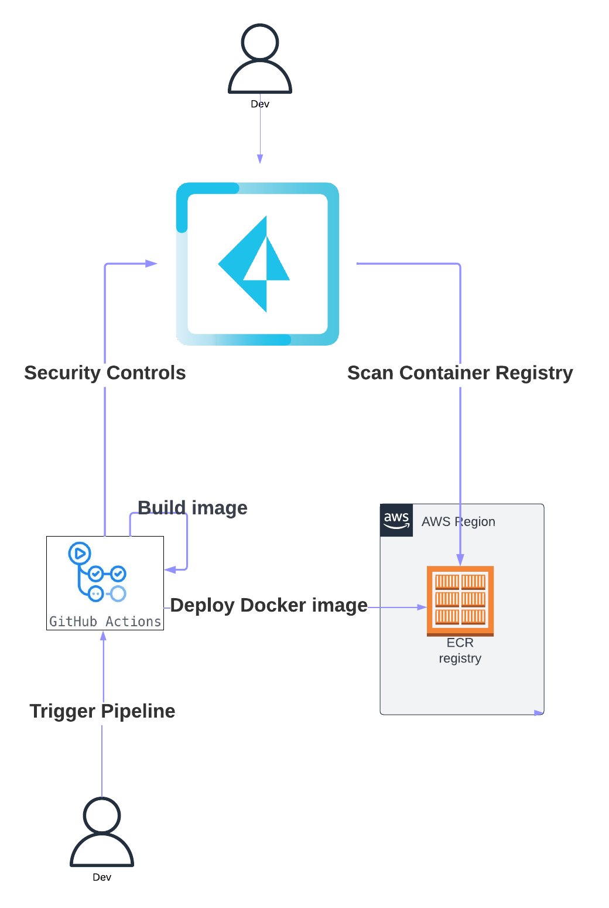

# Build, scan and deploy a docker image to an AWS ECR registry securely with Prisma Cloud and GitHub Action.

#### Objectifs

Github Action pipeline to build and deploy a docker image in an AWS ECR.

Build, Scan and Deploy a simple NodeJS image to an AWS ECR Registry with GitHub Action and Prisma Cloud

The image is tested and validated by Prisma Cloud, to check for vulnerabilities and compliance and authorize or not the deployment to the AWS ECR Registry.

#### Requirements

- **GitHub Account** to create private fork
- **AWS Subscription** with Programmatic Access (**AWS_ACCESS_KEY_ID / AWS_SECRET_ACCESS_KEY** )
- **Prisma Cloud Tenant** with AccessKey & Secret

#### Prerequisites

##### 1. Create a fork of the repository

1. Login with your github account
2. Open https://github.com/cleypanw/docker_nodejs_demo and click on Fork

##### 2. Configure GitHub Action Secrets

Open **Settings > Security > Secrets and variables > Actions**

- Secrets

  - **AWS_ACCESS_KEY_ID**

  - **AWS_SECRET_ACCESS_KEY**

  - **PCC_CONSOLE_URL** (Prisma Cloud Console URL)

  - **PCC_PASS** (Prisma Cloud Access Key)

  - **PCC_USER** (Prisma Cloud Secret Key)

    

#### Sequence Diagram

#### High Level Diagram 

#### Rollout

<u>/!\ UNDER CONSTRUCTION /!\</u>

Build, Scan and Deploy a simple NodeJS image to an AWS ECR Registry with GitHub Action and Prisma Cloud

1. AWS ECR Repository is created during GitHub Action process (control if repository exists and create if not)
2. Prisma Cloud checks vulnerabilities and compliance during build phase before pushing image to AWS ECR Registry
3. Depending on Prisma Cloud configuration, the build may be rejected and deployment prohibited (Hard Fail). 
4. Errors can be injected into the Dockerfile to force failure (for demonstration purposes) 

If you want to use the Prisma Cloud security control on your Dockerfile in your Github repo, you can.
Usage: deploy this workflow in the GitHub repository containing your Dockerfile, update the variables and secret in your GitHub repository settings (Prisma Access/Secret Key, AWS Secret, etc.).

### Author: Christopher LEY - cley@paloaltonetwork.com
